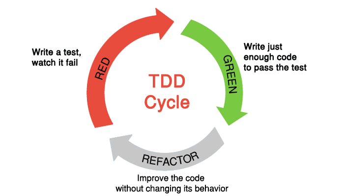

# Test Driven Development

## What is test?

테스트 코드란, 우리가 작성한 코드를 검증하는 코드입니다. 우리가 작성한 코드가 다양한 경우의 수에 대해 우리가 예상하는 대로 작동하는 지에 대해 검증하는 코드를 테스트 코드라고 말합니다. 테스트를 작성함으로 인해, 우리는 우리의 코드에 대한 검증을 더욱 편리하게 할 수 있습니다.

하나의 어플리케이션 코드 베이스는 수십, 수백 개의 파일 혹은 모듈이 다양한 방식으로 엮여 있습니다. 이 중 일부를 수정했을때 과연 기존의 기능이 여전히 잘 작동되는지 확인하는 것은 생각보다 굉장히 어려운 작업입니다. 테스트 코드를 작성해놓을 경우, 이런 작업을 조금 더 수월하게 진행할 수 있게 됩니다.

물론 테스트 코드 자체도 사람이 작성하고 관리하는 것이기 때문에, 오류가 있을 수 밖에 없습니다. 그래서 잘못 작성된 테스트 코드는 테스트 코드가 없는 것보다 못할 수도 있습니다. 그리고 테스트 코드를 작성한다는 것은 코드의 유지 보수 관점에 있어, 관리해야 할 항목이 늘어나는 것이기도 합니다. 왜냐하면 기능을 수정할때마다 테스트 코드도 함께 관리해주어야 하기 때문입니다.

테스트 코드를 작성하는 것은 여러 가지 장단점이 있지만, 잘 작성해놓은 테스트 코드는 분명 도움이 될 것입니다.

## What is Test Driven Development(TDD)?

TDD란, Red - Green - Refactor의 사이클로 반복하며 개발하는 방식을 뜻합니다.

- Red: 테스트를 먼저 작성하고, 테스트가 실패하는 것을 확인합니다.
- Green: 테스트가 통과하기에 충분한 정도의 코드를 작성합니다.
- Refactor: 작성한 코드를 개선시키는 방향으로 코드를 수정합니다. 수정 후, 테스트가 실패할 경우 다시 Red - Green - Refactor를 반복합니다.

## Different purpose, different tests

테스트에는 여러 가지 종류가 존재합니다. 그 중 몇 가지를 소개 해드리도록 하겠습니다.

### 1. Unit Test

단위 테스트라고 불리는 테스트입니다. 단위라는 의미는 문맥에 따라 달라질 수 있습니다. 프론트엔드에서는 컴포넌트 하나를 하나의 단위로 설정하고 테스트를 작성할 수도 있고, 백엔드에서는 Endpoint 하나를 단위로 설정하고 테스트를 작성할 수도 있습니다. 그 외에도 함수 하나를 하나의 단위로 설정할 수도 있습니다.

### 2. Integration Test

통합 테스트라고 불리는 테스트입니다. 각각의 단위들이 모여 우리 어플리케이션의 기능을 만들어주게 되는데, 그 단위들이 모여 성공적으로 기능이 작동되는지에 대한 검증을 하는 테스트입니다. 그 말은 즉, 단위들이 모여 성공적으로 기능이 작동하지 않을 수도 있다는 의미입니다.

[https://media.tenor.com/images/1725861ab5a290ba6b9be9f8a15db74e/tenor.gif](https://media.tenor.com/images/1725861ab5a290ba6b9be9f8a15db74e/tenor.gif)

위의 GIF를 보시면, 자동 감지 수도꼭지는 매우 잘 작동하고 있습니다. 그리고 세면대 또한 별 이상이 없습니다. 이것은 각각의 단위는 정상적으로 작동함을 의미합니다.

하지만 두 가지 단위가 만나서 통합되었을때, 우리가 원하는 방향으로 작동하지 않고 있음을 확인할 수 있습니다.

## Mocking

테스트를 작성할 때 중요한 개념 중 하나는 [Mocking](https://stackoverflow.com/questions/2665812/what-is-mocking)입니다.

> Mocking is primarily used in unit testing. An object under test may have dependencies on other (complex) objects. To isolate the behavior of the object you want to replace the other objects by mocks that simulate the behavior of the real objects. This is useful if the real objects are impractical to incorporate into the unit test.

우리가 특정 단위의 코드를 테스트한다고 하면, 그 단위는 여러 가지 Dependency를 갖고 있을 가능성이 있습니다. 그럴 경우, 우리가 테스트하고자 하는 단위 이외의 Dependency들은 그와 유사한 가짜 정보를 생성하여 대체하곤 합니다. 이것을 Mocking이라고 합니다.

예를 들어, A라는 단위를 테스트한다고 생각해보세요. 그리고 A라는 단위는 B라는 모듈에 대해 Dependency를 갖고 있습니다. 실제 B 모듈을 이용하여 A 모듈의 단위 테스트가 실행될 경우, A 모듈 자체적인 이유로도 테스트가 실패할 수 있지만, 정작 A 모듈은 정상적으로 작동하는데 B 모듈의 문제로 인해 A 모듈의 테스트가 실패할 수도 있습니다. 그런 경우가 생긴다면 우리는 A 모듈 단위 테스트의 목적을 벗어나게 됩니다.

그렇기에 우리가 테스트하고자 하는 단위를 고립시키고 정말 순수하게 해당 단위만을 테스트하기 위해, 관련 Dependency들은 가짜로 대체하는 행위를 Mocking이라고 합니다.

## Testing utility functions

초보자가 가장 먼저 시도해 볼 수 있는 테스트는 Utility 함수 단위 테스트 입니다. Utility 함수란, Underscore/Lodash 의 함수들처럼 일반적으로 다양한 상황에 사용될 수 있는 단순한 함수들을 일컫습니다. 예) 날짜 포맷 변환 함수, 화폐 단위 변환 함수 등

각 경우의 수에 대해 고민해보는 것이 가장 중요합니다. Argument는 어떤 경우의 수가 있는지, 그에 따른 Output은 어떤 경우의 수가 있는지, 어떤 경우에는 에러 처리를 해야 하는지 등을 테스트 할 수 있습니다.

최근에 가장 많이 사용되는 테스트 작성용 라이브러리는 [Jest](https://jestjs.io/), [Mocha](https://mochajs.org/) 등이 있습니다.

## Testing React components

React 프로젝트에서는 하나의 컴포넌트를 하나의 단위로 하여 단위 테스트를 작성하기도 합니다. 기본적으로 일반 함수와 동일하게, 외부에서 Props가 들어올 경우의 수는 어떤 것들이 있는지, 그에 따른 Render 결과물은 어떻게 되어야 하는지, 내부 State는 어떻게 변해야 하는지, User Interaction은 어떻게 처리해야 하는지 등을 테스트 할 수 있습니다.

바닐라코딩의 과제 프로젝트는 [Create React App](https://facebook.github.io/create-react-app/)을 이용하여 만들어졌기 때문에, Create React App의 Test 작성하기 페이지를 참고하여 Test Code를 작성하시기 바랍니다.

### Test 작성 전 확인할 것들

- Create React App: [Running Tests](https://facebook.github.io/create-react-app/docs/running-tests)
- Enzyme for React Component Test: [Testing with Shallow Rendering](https://create-react-app.dev/docs/running-tests#option-1-shallow-rendering)

### Test Library Documents

- [Enzyme](https://airbnb.io/enzyme/)
- [Jest](https://jestjs.io)

### Test 순서

- (Redux와 함께 작업하는 경우, Jest를 이용하여 Reducer 함수에 대한 Unit Test를 먼저 작성해보세요.)
- State가 거의 없고, Props를 받아 Render해주는 최대한 단순한 컴포넌트부터 테스트 작성을 시도해보세요.
- State가 있는 컴포넌트, Event Handling을 하는 컴포넌트 등에 대해서도 테스트 작성을 시도해보세요.
- React 문서의 [Testing Recipes](https://reactjs.org/docs/testing-recipes.html)를 보고 React만의 Testing Pattern을 익혀보세요.

## Testing Reducers in Redux

Redux 패턴에서 Reducer 함수는 Pure Function입니다. 그렇기에 테스트 작성이 상대적으로 간단하고 쉽습니다. 아래 링크를 참고하여 테스트 작성을 해보세요.

[https://github.com/reduxjs/redux/blob/master/examples/todomvc/src/reducers/todos.spec.js](https://github.com/reduxjs/redux/blob/master/examples/todomvc/src/reducers/todos.spec.js)
